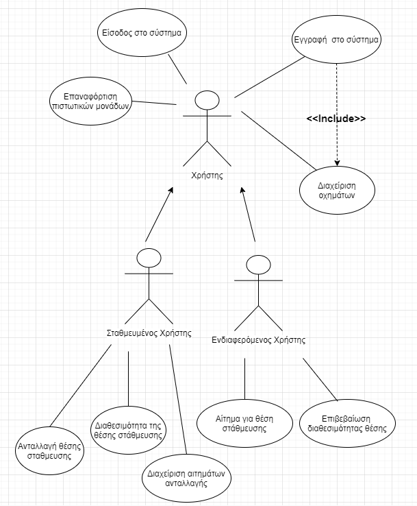

# Αίτημα για θέση στάθμευσης

**Πρωτεύων Actor**: Ενδιαφερόμενος χρήστης  
**Ενδιαφερόμενοι (Stakeholders)**: Σταθμευμένος χρήστης  
**Προϋποθέσεις**: Πρέπει να έχει ολοκληρωθεί επιτυχώς η Π.Χ. "Διαθεσιμότητα της θέσης στάθμευσης" και να έχει επαρκείς πιστωτικές μονάδες.  
**Βασική ροή γεγονότων**:   
1) Δηλώνει την περιοχή και τον εκτιμώμενο χρόνο που θα φτάσει.  
2) Το σύστημα του εμφανίζει θέσεις στάθμευσης στην περιοχή που έχει υποδείξει, μετά την ώρα που έχει βάλει.  
3) Επιλέγει την θέση που προτιμάει.  
4) Η εφαρμογή στέλνει μήνυμα στον σταθμευμένο χρήστη. 

**Εναλλακτικές ροές**:   
1) Η περιοχή που εισήγαγε δεν υπάρχει.  
    1. Του εμφανίζεται μήνυμα από το σύστημα.   
 

2) Δεν υπάρχουν θέσεις/χρήστες στην περιοχή που έχει υποδείξει.  
    1. Το σύστημα του στέλνει μήνυμα να επεκτείνει την περιοχή αναζήτησης του. 

# Ανταλλαγή θέσης στάθμευσης

**Πρωτεύων Actor**: Σταθμευμένος χρήστης  
**Ενδιαφερόμενοι (Stakeholders)**: Ενδιαφερόμενος χρήστης  
**Προϋποθέσεις**: Πρέπει να έχει ολοκληρωθεί επιτυχώς η Π.Χ. "Επιβεβαίωση διαθεσιμότητας θέσης"  
**Βασική ροή γεγονότων**:  
1) Καταχωρεί τον κωδικό που του έχει δώσει προφορικά ο ενδιαφερόμενος χρήστης στην εφαρμογή.  
2) Το σύστημα του μεταφέρει τις μονάδες στον λογαριασμό του από τον λογαριασμό του ενδιαφερόμενου.     
3) Το σύστημα αφαιρεί τη θέση απο την εφαρμογή.  
4) Βαθμολόγηση ενδιαφερόμενου. 

**Εναλλακτικές ροές**:  
1 ) Λάθος κωδικός.  
    
1. Το σύστημα ζητάει να επαναπληκτρολογηθεί ο κωδικός.  

4 ) Απόρριψη αιτήματος βαθμολόγησης ενδιαφερόμενου χρήστη.

    