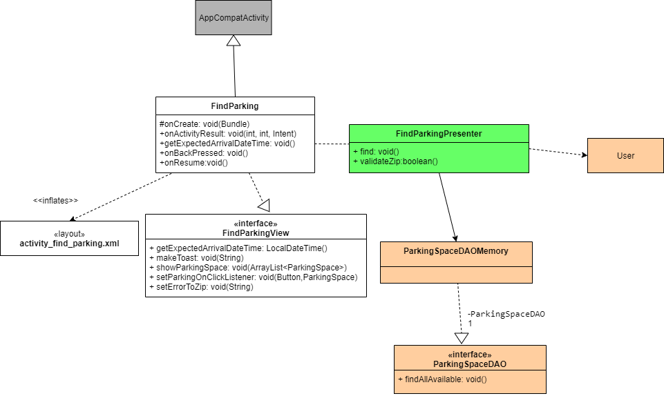
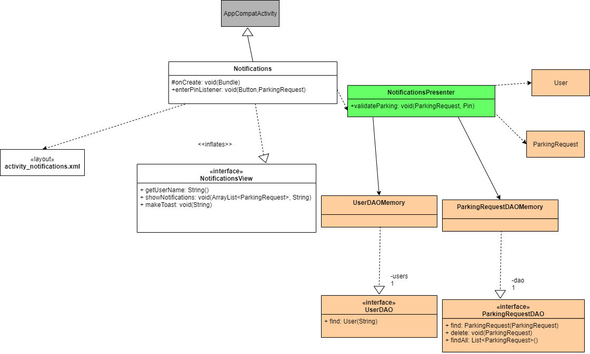
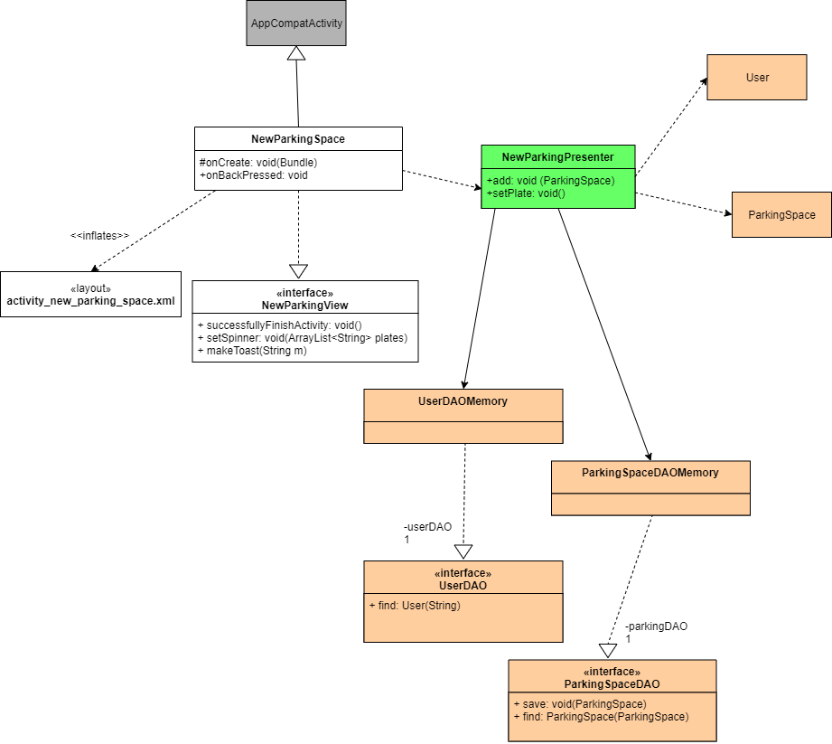
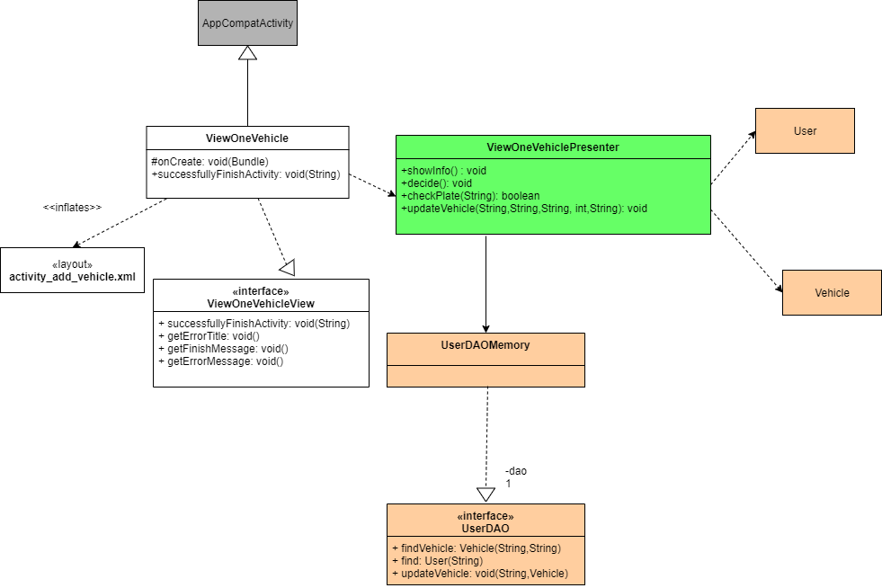
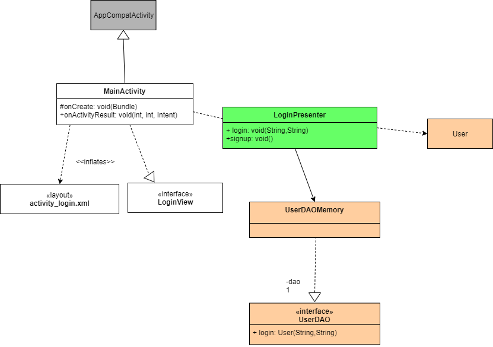
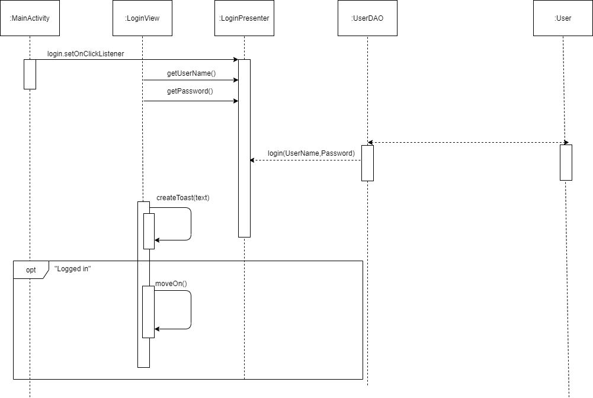
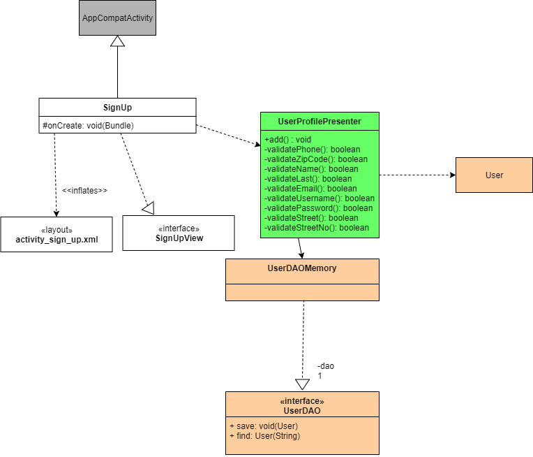
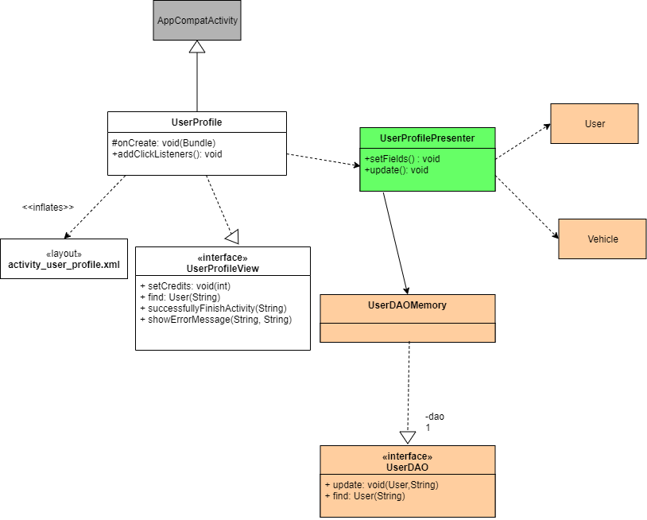

# Αίτημα για θέση στάθμευσης / Find Parking

   

# Ανταλλαγή θέσης στάθμευσης / Enter Pin

   

# Διαθεσιμότητα της θέσης στάθμευσης / Add Your Parking Space

   

# Διαχείριση αιτημάτων ανταλλαγής / Approve Parking Request

   

# Διαχείριση οχημάτων / Edit Vehicle

   

# Είσοδος Στο Σύστημα / Login

   

# Εγγραφη Στο Σύστημα

   

# Επαναφόρτιση Πιστωτικών Μονάδων

   

# Επιβεβαίωση διαθεσιμότητας θέσης
   

